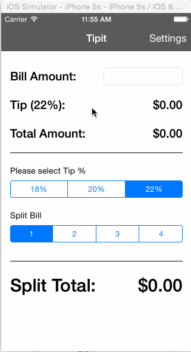

Tipit - Tip Calculator
==============

Tipit is a simple tip calculator application that will calculate the tip based on the bill amount that an user types in. Tip percentages can be chosen between 18%, 20% and 22%. The user can also select default tip percentage in the settings view and split the bill between 1 to 4 people.  

Time spent: 5.5 hours spent in total

Completed user stories:

 * [x] Required: Display the tip amount as an user types the bill amount.
 * [x] Required: Add UIsegmentedControl to change tip percentage. Changing tip percentage will update the tip ammount accordingly.
 * [x] Required: Added settings view with default tip percetage using modal view with segue.
 * [x] Optional: Customized navigation bar color.
 * [x] Optional: Added split tip functionality using UIsegmentedControl.
 
Walkthrough of all user stories:

GIF created with [LiceCap](http://www.cockos.com/licecap/).
